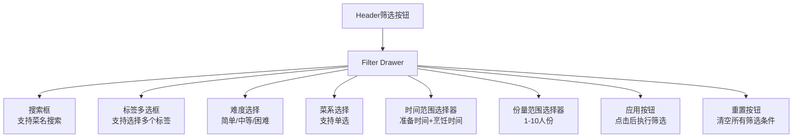
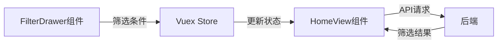

# 菜谱筛选功能设计方案

## 1. 功能概述
在应用的header中添加筛选按钮，点击后打开抽屉式菜单，用户可以通过多个条件组合筛选菜谱。

## 2. UI设计


## 3. 组件结构

### 3.1 组件关系


### 3.2 新增组件
- FilterDrawer.vue：抽屉式筛选菜单组件
  - 使用v-navigation-drawer实现抽屉效果
  - 包含筛选表单和操作按钮
  - 负责收集和提交筛选条件

### 3.3 修改现有组件
- AppHeader.vue：添加筛选按钮
- HomeView.vue：集成筛选功能，响应筛选条件变化

## 4. 数据结构

### 4.1 筛选条件对象
```javascript
{
  search: string,           // 搜索关键词
  tags: string[],          // 选中的标签数组
  difficulty: string,      // 难度级别：'简单'|'中等'|'困难'
  cuisine: string,         // 菜系
  prepTimeRange: {         // 准备时间范围（分钟）
    min: number,
    max: number
  },
  cookTimeRange: {         // 烹饪时间范围（分钟）
    min: number,
    max: number
  },
  servings: {             // 份量范围
    min: number,
    max: number
  }
}
```

## 5. API接口

### 5.1 请求格式
GET /api/recipes
```javascript
{
  search?: string,
  tags?: string[],
  difficulty?: string,
  cuisine?: string,
  prepTimeMin?: number,
  prepTimeMax?: number,
  cookTimeMin?: number,
  cookTimeMax?: number,
  servingsMin?: number,
  servingsMax?: number,
  page?: number,
  limit?: number
}
```

### 5.2 响应格式
```javascript
{
  items: Recipe[],
  total: number,
  page: number,
  limit: number
}
```

## 6. 具体实现步骤

### 6.1 前端实现
1. 在AppHeader.vue中添加筛选按钮
   - 使用v-btn和v-icon组件
   - 点击触发抽屉打开

2. 创建FilterDrawer.vue组件
   - 实现抽屉布局和表单控件
   - 添加筛选条件双向绑定
   - 实现应用和重置功能

3. 更新前端API service
   - 添加筛选参数处理
   - 更新请求URL构建逻辑

4. 在HomeView中集成筛选功能
   - 监听筛选条件变化
   - 更新数据获取逻辑
   - 添加加载状态处理

### 6.2 后端实现
1. 更新Recipe模型的get_all_recipes方法
   - 添加新的筛选参数支持
   - 优化查询性能
   - 添加参数验证

2. 更新路由处理
   - 添加新的筛选参数解析
   - 实现参数验证
   - 返回筛选结果

## 7. 性能优化考虑
1. 使用防抖处理用户输入
2. 实现结果缓存
3. 优化数据库查询
4. 添加适当的加载状态提示

## 8. 测试计划
1. 单元测试
   - 筛选组件渲染测试
   - 筛选条件变更测试
   - API调用测试

2. 集成测试
   - 筛选流程测试
   - 数据更新测试
   - 错误处理测试

3. 性能测试
   - 响应时间测试
   - 并发请求测试
